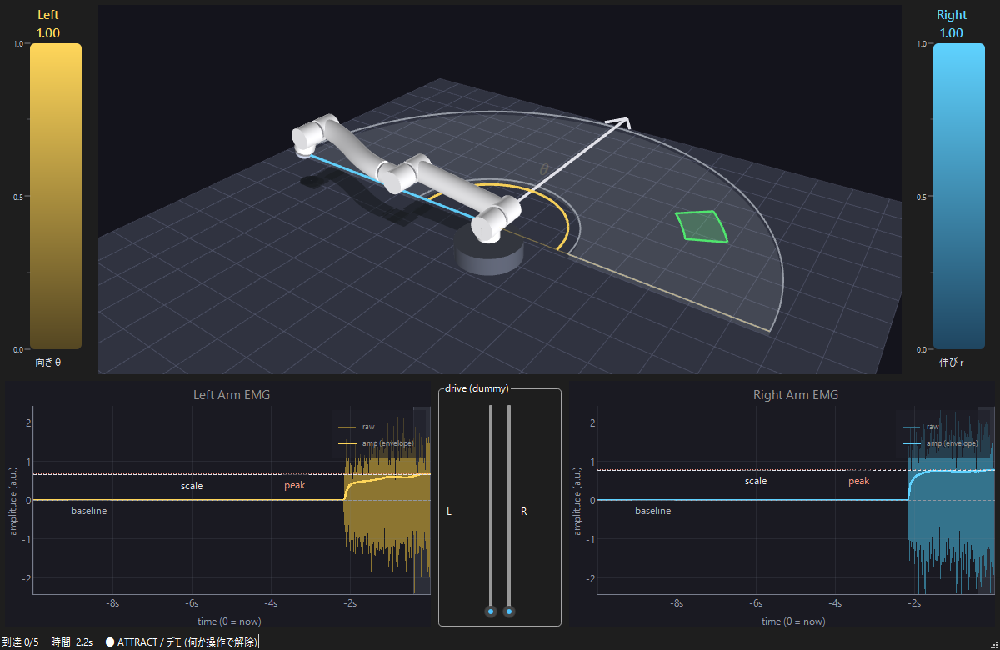
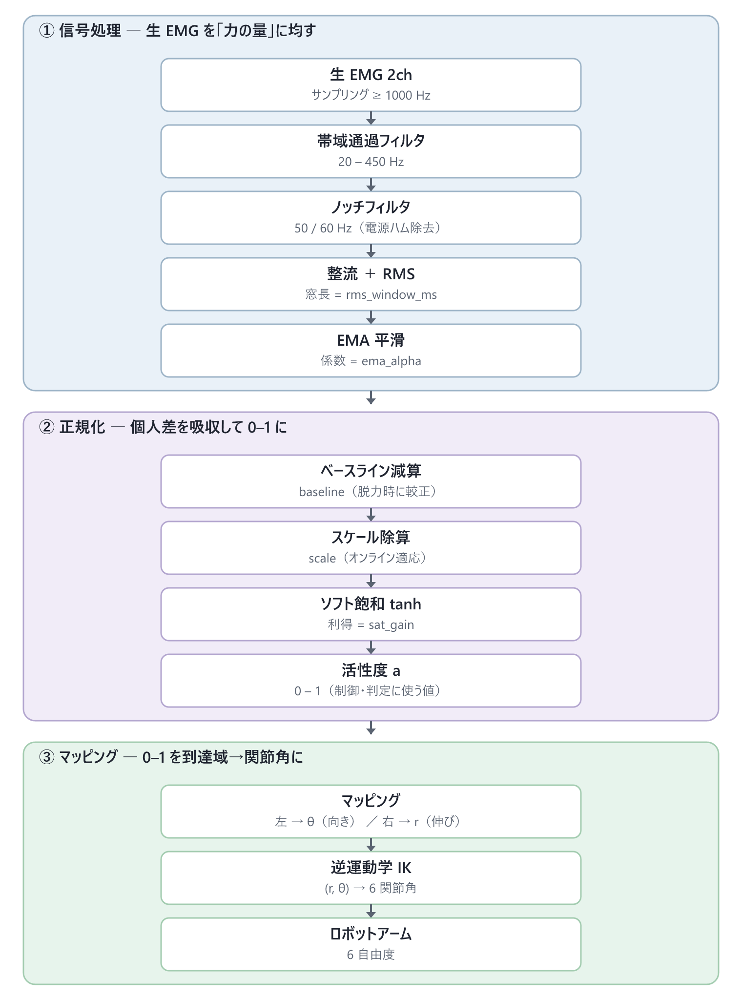

# emg-simulator

**EMG-driven robot-arm reaching game** for a university open-campus exhibit. Two
forearm EMG channels drive a simulated 6-DOF robot arm in polar `(r, θ)` control —
**left arm → azimuth `θ`, right arm → reach `r`** (swappable in config) — and you
flex to guide the arm tip into a target and hold it. Full-Python implementation,
and **no hardware is needed to try it**: a built-in dummy input source (keyboard /
sliders / auto-demo) runs the whole game.



## Try it in a minute

Python 3.10–3.13, then:

```bash
git clone https://github.com/codria/emg-simulator.git
cd emg-simulator
python -m venv .venv && source .venv/Scripts/activate   # PowerShell: .venv\Scripts\Activate.ps1  ·  or use conda
pip install -r requirements.txt
python -m emg_sim.app --auto        # attract/demo — drop --auto to drive it yourself
```

Full clone-to-run walkthrough (venv/conda, Windows long-path note, troubleshooting):
**[docs/QUICKSTART.md](docs/QUICKSTART.md)**.

### Controls

| Key | Action |
|---|---|
| **F** / **J** (hold) | flex left / right arm — **F → θ** (azimuth), **J → r** (reach). Or drag the on-screen sliders. |
| **B** | capture the rest baseline (relax — "力を抜いて") |
| **D** | toggle attract / demo mode |
| **S** | settings — live sliders (RMS window, EMA, soft-sat gain, scale floor, reach tolerances r/θ, …) + JSON save/load |
| **C** | connection dialog — switch input between Dummy and a real BioRadio |
| **R** | reset the round |
| mouse | drag to orbit, wheel to zoom the 3D scene |

Move both bars into their target bands so the tip enters the green **(r, θ) wedge**,
then hold it there — a bright charge fills the wedge and a flash confirms the reach.

## How it works

Raw EMG is noisy, so each channel is smoothed into a "how hard are you flexing"
value, normalized per person to `[0,1]`, mapped to `(r, θ)`, and solved to joint
angles by inverse kinematics:



- **Signal processing** — band-pass + mains-notch → rectify / RMS window → EMA.
- **Normalization** — baseline subtraction (rest) + an online-adapting `scale` (a
  *leaky* recent-peak) + `tanh` soft-saturation, so it self-tunes to each person
  and can't latch onto an unreachable gain.
- **Control** — activation → `(r, θ)` on a shoulder-height operation plane →
  damped-least-squares (Levenberg–Marquardt) Jacobian IK with elbow / tool-down
  posture sub-tasks.
- **Game** — spawn a target in the fan; count a reach when the tip dwells inside
  its `(r, θ)` tolerance wedge.

Parameter reference (client-facing spec): **[docs/signal_processing_spec.md](docs/signal_processing_spec.md)**
(builds to docx/pdf/html via `node docs/build_docx.mjs`). Design rationale:
**[docs/emg_robotarm_exhibit_design.md](docs/emg_robotarm_exhibit_design.md)**.

## Features

- Real-time **3D scene** (PySide6 + PyQtGraph GL): smooth-shaded arm, floor board +
  planar shadow, reach fan, forward arrow, r/θ teaching overlay, 4× MSAA.
- **Two EMG bars** (θ / r) with target bands, plus **live waveform** panels showing
  the envelope against baseline / scale / peak.
- **(r, θ) target wedge** with a dwell "charge" and completion flash; reach
  tolerance is per-axis so θ (higher gain — arc = r·Δθ) can be eased independently.
- **Settings window** — every tunable on a live slider, with JSON save/load.
- **Sound** — a subtle zone-enter click and a reach chime, with a synthesized
  fallback so a fresh clone has sound without shipping any audio files.
- **Input sources** — built-in dummy (keyboard / sliders / auto-demo) and a real
  **BioRadio** (pythonnet, Windows), switchable at runtime.

## Kinematics, verified against C++

`emg_sim/kinematics/arm.py` is a numpy port of the C++/GLM reference
`KinectArmSimulator/src/window3/arm.cpp`, cross-checked against it: the committed
`tools/cpp_ref/ref_cases.json` is emitted by the C++ and replayed by the numpy
port. Observed agreement: **FK ~1e-7, IK joint angles ~1e-7**.

```bash
python tools/verify_ik_vs_cpp.py          # numpy-vs-C++ diff report
bash   tools/cpp_ref/build_and_dump.sh     # (re)generate ref_cases.json (needs g++ + the KAS repo)
```

## Tests

```bash
pytest                 # full suite
pytest -m "not slow"   # fast subset
```

## Layout

```
emg_sim/
  acquisition/   input sources: dummy + BioRadio (pythonnet)
  dsp/           filter, RMS/EMA pipeline, normalize
  control/       activation → (r,θ) → cartesian target; mapping
  kinematics/    6-DOF arm model + damped-least-squares IK   (verified vs C++)
  game/          target spawn + dwell reach detection
  ui/            PySide6 / PyQtGraph 3D scene, bars, waveforms, settings, sound
  engine.py      Qt-independent tick loop        app.py   entry point
tools/           C++ reference dumper + numpy-vs-C++ verifier
docs/            design doc, decisions, signal-processing spec, quickstart
tests/           pytest suite
```

## Status

The full game runs end-to-end on the dummy input source. The BioRadio path is
implemented and validated headless (SDK load → device discover); **live streaming
and FW-1.0 confirmation await the physical device**.

## License

[MIT](LICENSE) © 2026 codria. Built for a university open-campus exhibit.
The bundled sound effects are **not** redistributed (see
[docs/decisions.md](docs/decisions.md) for provenance); the app synthesizes
fallbacks so it runs with sound out of the box.
