# 筋電ロボットアーム展示 ― 信号処理・制御パラメータ仕様

EMG（筋電）2ch から「力の入れ具合」を取り出し、ロボットアームの
**リーチ `r`（伸び）** と **旋回 `θ`（向き）** に割り当てるまでの、処理チェーンと
各パラメータの意味・既定値・調整指針をまとめた資料。先方への仕様説明用。

> 対応実装：`emg_sim/dsp/`（信号処理・正規化）、`emg_sim/control/`（マッピング・IK）、
> `emg_sim/config.py`（全パラメータの既定値）。設定はアプリの設定ウィンドウ（**S** キー）で
> スライダ調整＋JSON 保存できる。

---

## 1. 全体像

- 独立な入力は **EMG 2ch** ＝ 同時に独立制御できる自由度は **最大2**。
- 割り当て：**左腕 → θ（向き）／右腕 → r（伸び）**（config で入替可）。
- 生 EMG は激しく振動するので、**「力の量」に均して → 個人差を吸収して [0,1] に正規化 →
  アームの (r, θ) に変換 → 逆運動学で関節角** に落とす。

```mermaid
flowchart LR
    A["生 EMG 2ch<br/>(≥1000 Hz)"] --> B["帯域通過<br/>20–450 Hz"]
    B --> C["ノッチ<br/>50/60 Hz"]
    C --> D["整流＋RMS<br/>窓 = rms_window_ms"]
    D --> E["EMA 平滑<br/>ema_alpha"]
    E --> F["ベースライン減算<br/>baseline（脱力時）"]
    F --> G["スケール除算<br/>scale（オンライン適応）"]
    G --> H["ソフト飽和<br/>tanh · sat_gain"]
    H --> I["活性度 a ∈ [0,1]"]
    I --> J["マッピング<br/>左→θ / 右→r"]
    J --> K["逆運動学 (IK)"]
    K --> L["ロボットアーム"]
```

<!--FIG-REPLACE pipeline 11-->


処理の役割を大きく3段に分けると：

| 段 | 目的 | 主パラメータ |
|---|---|---|
| **① 信号処理**（filter→RMS→EMA） | 生 EMG を滑らかな「力の量」に | `rms_window_ms`, `ema_alpha`, フィルタ帯域 |
| **② 正規化**（baseline→scale→tanh） | 個人差を吸収して [0,1] に | `baseline`, `scale`(適応), `sat_gain` |
| **③ マッピング・IK** | [0,1] を到達域の (r,θ)→関節角に | `r_min/r_max`, `θ`, 肘・tool-down |

---

## 2. 各段の詳細

### 2.1 取得（Acquisition）

- BioRadio から EMG 2ch を取得（`GetScaledValueArray`）。
- **サンプリングは EMG 特性上 ≥1000 Hz が標準**（帯域が ~450 Hz まであり、Nyquist で最低 1000 Hz）。
- `sample_rate`（既定 1000）は、以降の「ms 指定」を内部でサンプル数に換算する基準。
  実機のレートに合わせればよく、**ms 値はレート非依存**。

### 2.2 帯域通過 ＋ ノッチ（§6）

- **帯域通過 20–450 Hz**（Butterworth）：運動アーチファクトの低域ドリフトと帯域外ノイズを除去。
- **ノッチ 50/60 Hz**：商用電源ハム除去（地域で 50 or 60）。
- ストリーミング（逐次）で SOS フィルタとして適用。合成ダミー入力にはハムが無いので影響は小。

### 2.3 整流 ＋ RMS 窓

生 EMG は ±に激しく振動するので、直近 `rms_window_ms` の窓で **RMS（二乗平均平方根）** を取り、
「今どれだけ力んでいるか」の**正の振幅**に均す（RMS は自乗するので整流も兼ねる）。

```
rms = sqrt( mean( x_win^2 ) )     # x_win = 直近 (rms_window_ms) のサンプル
```

- **短い窓**：反応が速いが**ガタつく** ／ **長い窓**：滑らかだが**遅れる**。
- 「即応 ↔ 安定」の主ツマミ。既定 150 ms（設計目安 100–300 ms）。

### 2.4 EMA 平滑

RMS 出力にさらに**軽い指数移動平均（EMA）**を掛け、フレーム間の残ジッタを一段慣らす。

```
amp = ema = ema_alpha · rms + (1 − ema_alpha) · ema_prev
```

- `ema_alpha` が大きいほど即応（平滑弱）、小さいほど滑らか（平滑強）。既定 0.25。
- RMS 窓と役割は重複気味だが、**窓は矩形（遅延↑）／EMA は IIR（少ない遅延で残ジッタ除去）**という別特性。
  `ema_alpha = 1.0` にすれば EMA は無効（＝RMS のみ）にできる。

### 2.5 正規化（個人差の吸収）

EMG 振幅は個人差が桁で違うため、**[0,1] の共通スケール**に正規化する。3手順：

**(a) ベースライン減算** ― 脱力時のノイズフロアを引き、脱力＝0 にする。
較正（**B** キー、`baseline_sec` 秒「力を抜いて」）で取得。全力（MVC）より脱力の方が確実。

```
x = max(0, amp − baseline)     # 脱力を超えた「力み量」(≥0)
```

**(b) スケール除算（オンライン適応）** ― 「満力」の基準値 `scale` で割る。
`scale` は固定ではなく、**直近の観測ピーク `peak` に低速追従**する。`peak` は力んだ瞬間に
跳ね上がり、放つと **半減期 `peak_halflife_sec` でゆっくり減衰**する「直近最大（リーク付き）」。
`scale` はその `peak`（下限 `fallback_scale`）へ **両方向**に EMA 追従する。較正が甘い人でも本気を
出せば追従し、逆に一度の全力やアーチファクトで上がり過ぎても時間で戻るので、端に届かなくなる事故を防ぐ。

```
peak  = max( peak · 0.5^(dt/peak_halflife_sec), x )   # リーク付き「直近最大」
target = max( peak, fallback_scale )                  # 下限は fallback
scale += adapt_rate · (target − scale)                # target へ両方向 EMA 追従
a_pre  = x / scale                                    # 満力で ≈1.0 になる正規化比
```

- `scale` の初期値・下限は `fallback_scale`（既定 0.5）。誰も較正しなくても最低限動く保険。
- 上がり過ぎた `scale` は `peak` の減衰につれて**戻る**（回復は概ね半減期×2）。アイドルでは fallback へ。

**(c) ソフト飽和（tanh）** ― `a_pre` を tanh で滑らかに [0,1) に圧縮。
1.0 に**ハードに張り付かせない**ので、較正が雑でも振り切れず、上を超えた分も緩く効く。

```
a = tanh( sat_gain · a_pre )    # soft_sat=ON のとき（OFF なら clip(a_pre,0,1)）
```

- `sat_gain` は tanh の**急峻さ**。大＝軽い力で最大近くまで／小＝じっくり微調整。既定 1.6。

### 2.6 マッピング（活性度 → r, θ）

活性度 `a`（左＝θ用、右＝r用）を到達域の物理量に写す。
ソフト飽和で満力の `a` は 1.0 未満（≈`tanh(sat_gain)`）に留まるため、
**満力＝到達域の端** になるよう `reach_full_activation` で再スケールする。

```
a_eff = clip( a / reach_full_activation , 0, 1 )
r     = r_min + a_eff · (r_max − r_min)      # 右腕
θ     = θ_min + a_eff · (θ_max − θ_min)      # 左腕
target = ( r·cosθ, r·sinθ, z_plane )         # 操作平面上の目標座標
```

`target` を逆運動学（減衰最小二乗ヤコビアン IK）に渡し関節角を求める。
IK には姿勢の副次タスク（肘の畳み/伸ばし・手先を下向きに）を含む（§4）。

---

## 3. 主要な式（まとめ）

```
① 信号処理
   rms = sqrt(mean(x_win^2))                     # 窓 = rms_window_ms
   amp = α·rms + (1−α)·amp_prev                  # α = ema_alpha

② 正規化
   x     = max(0, amp − baseline)
   peak  = max(peak · 0.5^(dt/peak_halflife_sec), x)         # リーク付き直近最大
   scale += adapt_rate · (max(peak, fallback_scale) − scale) # 両方向 EMA 追従
   a     = tanh( sat_gain · x / scale )          # ← 活性度 ∈ [0,1)

③ マッピング
   a_eff = clip(a / reach_full_activation, 0, 1)
   r = r_min + a_eff·(r_max−r_min)   ,   θ = θ_min + a_eff·(θ_max−θ_min)
```

---

## 4. 図解

### 4.1 ソフト飽和カーブ（`sat_gain = 1.6`）

`a_pre = x/scale`（力み比。1.0 ≒ 満力）に対する活性度 `a = tanh(1.6·a_pre)`：

<!--FIG-HERE tanh 12-->

| a_pre（力み比） | 0 | 0.25 | 0.5 | 0.75 | **1.0** | 1.5 | 2.0 |
|---|---|---|---|---|---|---|---|
| **活性度 a** | 0.00 | 0.38 | 0.66 | 0.83 | **0.92** | 0.98 | 0.997 |

満力（比=1.0）で 0.92、超過分は緩やかに 1.0 へ漸近＝**振り切れない**。
`sat_gain` を上げるとカーブが立ち（軽い力で上限へ）、下げると寝る（微調整しやすい）。

### 4.2 オンライン適応（peak はリーク付き直近最大／scale は両方向追従）

力むと `peak` は跳ね上がり、`scale` は **一気に飛ばず** じわっと追従する。放つと `peak` は
**半減期 `peak_halflife_sec` でゆっくり減衰**するので、一度の全力やアーチファクトで基準が
上がっても時間で戻り、以後ラクな力でも端まで届く（＝ラッチしっぱなしを防ぐ）。

<!--FIG-REPLACE adapt 13-->
```
x     ╱╲_力む_╲___ゆるめる______   (生の力み量)
peak  ╱‾‾‾‾‾‾╲__ゆっくり減衰__     (跳ね上がり→半減期で減衰)
scale ╱‾‾‾‾‾‾‾╲_追って戻る___      (peak へ両方向 EMA, 下限 fallback)
```

- **跳ね上がりは速く、減衰は遅い**（半減期 `peak_halflife_sec`、既定 45s → 回復 ~90s）。
- `scale` を即座に `peak` へ一致させると感度が急変して操作感が破綻するため、EMA で滑らかに追従。
- 上げ方向だけだと過大な基準が永久に残る（端に届かない）ので、**減衰＋両方向**で戻せるようにした。

### 4.3 到達域（操作平面と扇形）

- 操作平面は **肩の高さ z=`z_plane`**（水平）。ここが水平到達が最大の高さ。
- 到達域は **環状の扇形**：`r ∈ [r_min, r_max]`, `θ ∈ [θ_min, θ_max]`。
- 目標は端が難しいので、四辺から `target_margin` だけ内側に生成。

<!--FIG-REPLACE fan 12-->
```
        θ=90° (前方)
          │
   ┌──────┼──────┐   外弧 = r_max
   │ ░░░░░░░░░░░ │
   │ ░ 目標生成 ░ │   ← target_margin だけ内側
   │ ░░░░░░░░░░░ │
   └──────┼──────┘   内弧 = r_min
  θ=180°  ●  θ=0°     ● = アーム基部（原点）
        （台座）
```

---

## 5. パラメータ一覧（適用数値）

### 信号処理（`SignalConfig`）

| 名前 | 変数 | 既定 | 範囲(調整) | 効果 |
|---|---|---|---|---|
| サンプリング | `sample_rate` | 1000 Hz | 実機に合わせる | ms→サンプル換算の基準 |
| RMS 窓 | `rms_window_ms` | 150 ms | 10–400 | 小=即応/ビクビク、大=滑らか/遅い |
| EMA α | `ema_alpha` | 0.25 | 0.05–1.0 | 大=即応、小=滑らか（1.0=EMA無効） |
| 帯域通過 | `bp_low`/`bp_high` | 20 / 450 Hz | 実EMG用 | 低域ドリフト・帯域外ノイズ除去 |
| ノッチ | `notch_freq` | 50 Hz | 50 or 60 | 電源ハム除去 |

### 正規化（`NormalizeConfig`）

| 名前 | 変数 | 既定 | 範囲 | 効果 |
|---|---|---|---|---|
| 較正時間 | `baseline_sec` | 2.0 s | — | 脱力ベースライン取得の秒数 |
| ソフト飽和 gain | `sat_gain` | 1.6 | 0.5–3.0 | 大=軽い力で上限へ、小=微調整しやすい |
| 適応率 | `adapt_rate` | 0.05 | 0–0.2 | scale が peak を追う速度（0=固定） |
| peak 半減期 | `peak_halflife_sec` | 45 s | 3–60 | 大=基準が長く残る／小=速く戻る（回復 ~2倍） |
| フォールバック | `fallback_scale` | 0.5 | — | scale の初期値・下限（保険） |

### マッピング・幾何（`ControlConfig`）

| 名前 | 変数 | 既定 | 効果 |
|---|---|---|---|
| リーチ範囲 | `r_min` / `r_max` | 0.23 / 0.70 | 到達域の内外半径（m） |
| 旋回範囲 | `θ_min` / `θ_max` | 0 / π | 扇の角度範囲 |
| 操作平面高さ | `z_plane` | 0.045 m | 肩の高さ＝最大到達 |
| 満力基準 | `reach_full_activation` | 0.9 | この活性度で r_max に届く再スケール |
| 肘（近/遠） | `elbow_target_near`/`far` | 2.0 / 0.1 | 近=畳む、遠=伸ばす（r で補間） |
| 手先下向き | `tool_down` / `_gain` | on / 0.35 | マニピュレータを目標に下向きに |

### ゲーム（`GameConfig`）

| 名前 | 変数 | 既定 | 効果 |
|---|---|---|---|
| 到達距離 | `reach_dist` | 0.05 m | 目標中心からこの距離以内で到達判定 |
| 滞在時間 | `hold_sec` | 0.4 s | 連続滞在でクリア（狙って止める要求） |
| 端マージン | `target_margin` | 0.12 | 扇の端を除外して目標生成 |
| 1ラウンド | `targets_per_round` | 5 | 5個到達でタイム→リセット |

---

## 6. 用語（変数）集

| 記号 | 意味 |
|---|---|
| `amp` | RMS＋EMA 後の平滑振幅（力の量、信号単位） |
| `baseline` | 脱力時の振幅（B 較正で取得）。これを引いて脱力=0 に |
| `x` | `amp − baseline`。脱力を超えた「力み量」(≥0) |
| `peak` | `x` の直近最大（力むと跳ね上がり、半減期 `peak_halflife_sec` で減衰＝リーク付き） |
| `scale` | 満力基準の除数。`peak`（下限 `fallback_scale`）へ両方向 EMA 追従 |
| `a`（活性度） | `tanh(sat_gain·x/scale)`。アームを動かす最終 [0,1] 値 |
| `r` / `θ` | リーチ（右腕）／旋回（左腕）。活性度から写像 |

---

## 7. 調整の目安（実機到着後）

1. **RMS 窓**で「ガタつき ↔ 遅れ」を合わせる（既定 150ms、ビクビクにするなら 10–30ms）。
2. **ソフト飽和 gain**で「軽さ ↔ 精密さ」を合わせる（既定 1.6）。
3. **適応率**は基本 0.05 のまま（振り切れる人が多ければ少し上げる、0 で固定）。
4. **peak 半減期**で「基準がどれだけ長く残るか」を調整（既定 45s、回復を速めたいなら下げる）。
5. **r_min/r_max・θ 範囲**を実機の可動域に合わせる。
6. **到達距離・滞在時間**で難易度を合わせる（展示は甘めが無難）。

すべて設定ウィンドウ（**S** キー）のスライダで即反映＋JSON 保存できるため、当日その場で追い込める。
